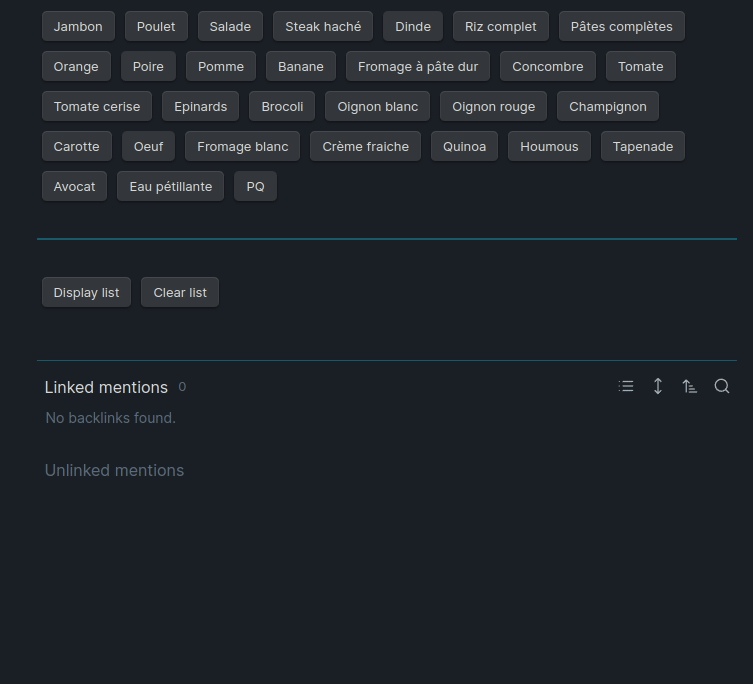

# Shopping list into a Obsidian note

## Generally
You can add or remove ingredients in the array
The name is selectElementToAdd
Just add or remove what you want

For better use, you can pass into the read mode
(Shortcut: `Ctrl + E`)

## Installation

- Add the plugin dataview to your obsidian vault (https://github.com/blacksmithgu/obsidian-dataview)
- Get the index.js and wrap the content like this and put it into a note


```
```dataviewjs
Put the content index.js here
\```
```


## Preview of shopping course


